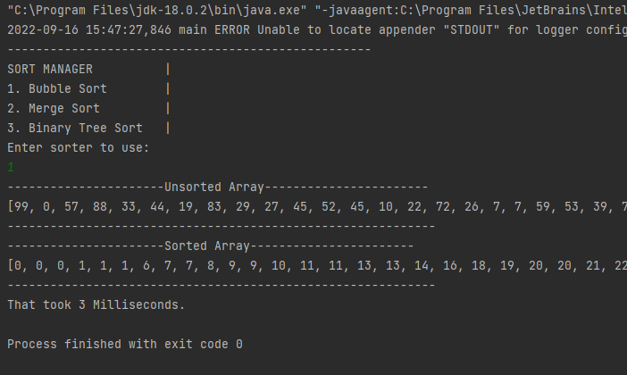
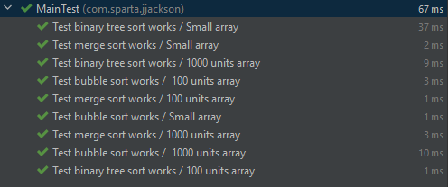
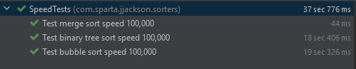

# Sort Manager

The sort manager program implements a generic Sorter interface with one method sortArray to create three sorting algorithm classes:
- Bubble sort
- Merge sort
- Binary Tree sort

Each of these algorithms are used withing the program in an MVC pattern, with the SortManager class controlling the flow of the program making use of the ArrayGenerator class to
get an array to sort, with the user deciding which sorting algorithm to use. 

The SortManager method runSorter uses System.currentMilliseconds() to calculate the time of each sort operation.

Apache log4j logging is also used, if chosen to leave it on for console output to log the Start and End times of the sorting algorithm that runs at the level of INFO.

Below image represents the program output with logging to the console turned off.



### Sort Manager
```java
public class SortManager {

    private Sorter sorter;

    private int[] array = ArrayGenerator.generateArray(100);

    private long startTime;
    private long endTime;

    private long totalTime;

    private int[] sortedArray;
    private final DisplayManager display = new DisplayManager();

    public static Logger logger = LogManager.getLogger(SortManager.class); // Logger

    public void start(){
        display.displayChoice();
        setSorterChoice();
        display.displayArray(array, "Unsorted Array");
        runSorter(array);
        display.displayArray(sortedArray, "Sorted Array");
        display.displaySortTime(totalTime);
    }

    void runSorter(int[] array){
        startTime = System.currentTimeMillis();
        logger.info("Start time");
        sortedArray = sorter.sortArray(array);
        endTime = System.currentTimeMillis();
        logger.info("End time");
        totalTime = endTime - startTime;
    }

    // Set program choice
     void setSorterChoice() {
        int[] choices = {1,2,3};
        int input = getInput(choices);

        switch(input){
            case 1:
                this.sorter = new BubbleSorter();
            case 2:
                this.sorter = new MergeSorter();
            case 3:
                this.sorter = new BinaryTreeSorter();
        }

    }

    // Get input
      int getInput(int[] choices){

        Scanner scan = new Scanner(System.in);
        int input = 0;
        boolean validInt = false;

        do {
            try {
                validInt = true;
                input = scan.nextInt();
                logger.info("Custom validation.....");
                if (!validateInput(input, choices)){
                    throw new ChoiceException("Choice outside of accepted values");
                }
            } catch (ChoiceException | InputMismatchException e){
                logger.error(e.getMessage(), e);
                scan.next();
                validInt = false;
                System.out.println("Please enter 1, 2 or 3");
            }
        } while (!validInt);

        return input;
    }

    // Validate input
      boolean validateInput(int input, int[] expectedChoices){

        for (int choice : expectedChoices){
            if (choice == input){
                logger.info("Input valid");
                return true;
            }
        }
        System.out.println("Please enter a 1, 2 or 3");
        logger.info("Invalid");
        return false;
    }
}
```

### Display Manager
```java
package com.sparta.jjackson.views;

import java.util.Arrays;

public class DisplayManager {

    public void displayChoice(){
        System.out.println("---------------------------------------------------\n" +
                            "SORT MANAGER          |\n" +
                            "1. Bubble Sort        |\n" +
                            "2. Merge Sort         |\n" +
                            "3. Binary Tree Sort   |\n" +
                            "Enter sorter to use:");
    }

    public void displayArray(int[] array, String message){
        System.out.println("----------------------" + message + "-----------------------");
        System.out.println(Arrays.toString(array));
        System.out.println("------------------------------------------------------------");
    }

    public void displaySortTime(long time){
        System.out.println("That took " + time + " Milliseconds.");
    }

}
```

### Bubble Sorter
The bubble sort algorithm uses two loops to iterate through the array to check if adjacent values are in the wrong size order, and swaps them. Initially, the bubble sort that was
implemented ran through checking the array at the maximum possible amount of iterations that would only be necessary if the array was in reversed order. Realistically, this was a
waste of efficiency and was fixed by adding the 'swaps' boolean flag to stop the program when no swaps were made on the outer loop of the array.
```java
public class BubbleSorter implements Sorter{
    @Override
    public int[] sortArray(int[] arrayToSort) {

        int len = arrayToSort.length;
        int temp = 0;
        boolean swaps = true;

        for (int i = 0; (i < len && swaps); i++) { // Each iteration through array

            swaps = false; // Swaps may not occur

            for (int j = 0; j < len - i - 1; j++) { // len - i - 1 sets j as the index to always be the first index of the 'couple' comparison

                // If first is larger than next
                if (arrayToSort[j] > arrayToSort[j + 1]) {

                    // Swap values
                    temp = arrayToSort[j];
                    arrayToSort[j] = arrayToSort[j + 1];
                    arrayToSort[j + 1] = temp;
                    swaps = true; // Swap has occurred
                }
            }
        }
        return arrayToSort;
    }
}
```

### Merge Sorter

The merge sort algorithm begins with the sort method that sorts the array passed into smaller blocks using left, mid and right variables to track where the splits are made. After
this, the merge method compares each of the split sub-arrays starting at index 0 for both, adding them to a new array until one sub-array is completely iterated over. The
remaining elements of the other sub-array are then copied over as to not over-index the finished array, and the resulting array is then returned to the initial method of sortArray to ensure it is
being returned inline with the interface contract.
```java
public class MergeSorter implements Sorter{
    
    // Interface method
    @Override
    public int[] sortArray(int[] arrayToSort) {

        sort(arrayToSort, 0, arrayToSort.length-1);

        return arrayToSort;
    }

    // Sort and recursion
    static void sort(int[] array, int left, int right) {

        if (left < right) {
            // Find the middle point
            int mid = left + (right - left) / 2;

            // Sort first and second halves
            sort(array, left, mid);
            sort(array, mid + 1, right);

            // Merge the sorted halves
            merge(array, left, mid, right);
        }
    }
    
    // Merge baby merge
    static void merge(int[] array, int left, int mid, int right) {

        // Find sizes of two sub-arrays to be merged
        int n1 = mid - left + 1;
        int n2 = right - mid;

        /* Create temp arrays */
        int[] leftArray = new int[n1];
        int[] rightArray = new int[n2];

        for (int i = 0; i < n1; ++i)
            leftArray[i] = array[left + i];

        for (int j = 0; j < n2; ++j)
            rightArray[j] = array[mid + 1 + j];

        // Initial indexes of first and second sub-arrays
        int i = 0, j = 0;

        // Initial index of merged subarray array
        int k = left;
        while (i < n1 && j < n2) {
            if (leftArray[i] <= rightArray[j]) {
                array[k] = leftArray[i];
                i++;
            }
            else {
                array[k] = rightArray[j];
                j++;
            }
            k++;
        }
        // Copy remaining elements
        while (i < n1) {
            array[k] = leftArray[i];
            i++;
            k++;
        }
        while (j < n2) {
            array[k] = rightArray[j];
            j++;
            k++;
        }
    }
}
```

### Binary Tree Sorter

The Binary Tree Sorter algorithm utilises the same interface method sortArray, that returns the sorted int array similarly with the other algorithms, however it uses two nested
classes of Node and Tree to initialise the array into a Binary Tree structure. The sortArray method creates the sarting Node and Tree instances and then loops through the array, calling the tree.add()
to construct the tree from the array elements. The sortArray method then calls the inorderRec recursive method to scale the tree and map values in order to a stream, which uses the toArray method to return the interface
specified int[] array.
```java
public class BinaryTreeSorter implements Sorter {

    @Override
    public int[] sortArray(int[] arrayToSort) {

        Node start = new Node(arrayToSort[0]);
        Tree tree = new Tree();

        for (int i = 1; i < arrayToSort.length; i++){ // Creates nodes of tree
            tree.add(start, arrayToSort[i]);
        }

        ArrayList<Integer> result = new ArrayList<>();

        return tree.inorderRec(start, result);
    }


    class Node{
        int data; // value of node
        Node left; // link to left child
        Node right; // link to right child

        public Node(int data) {
            this.data = data;
            this.left = null;
            this.right = null;
        }
    }

    class Tree{
        void add(Node start, int data){

            // If less go left, if null recall add
            if (start.data >= data) {
                if (start.left == null) {
                    start.left = new Node(data);
                } else {
                    // Create new tree recursion if node exists
                    add(start.left, data);
                }
            }
            // If bigger go right, if null create new node
            else {
                if (start.right == null){
                    start.right = new Node(data);
                } else {
                    // Create new tree recursion if node exists
                    add(start.right, data);
                }
            }
        }
        int[] inorderRec(Node start, ArrayList<Integer> result) {

            if (start != null)
            {
                inorderRec(start.left, result);
                result.add(start.data);
                inorderRec(start.right, result);
            }

            return result.stream().mapToInt(i -> i).toArray(); // Stack overflow thanks Java 8
        }
    }
}
```

### Exceptions

The program uses a custom exception ChoiceException that is thrown when the use inputs an integer that is not in the range 1-3 as it is not a valid choice as the view DisplayManager displays the sorter choices in an ordered list.

If at this point the user enters a char or string, an InputMismatchException is thrown at the line 'input = scan.nextInt()'.

Both of these exceptions are handled accordingly and logging is used to capture all levels of logs that are send to the logFile, but not to the console as to not interrupt the program display.

If these exceptions are thrown, the message 'Please enter a 1, 2 or 3' is displayed.

```java
    int getInput(int[] choices){
    
        Scanner scan = new Scanner(System.in);
        int input = 0;
        boolean validInt = false;
    
        do {
            try {
                validInt = true;
                input = scan.nextInt();
                logger.info("Custom validation.....");
                if (!validateInput(input, choices)){
                    throw new ChoiceException("Choice outside of accepted values");
                }
            } catch (ChoiceException | InputMismatchException e){
                logger.error(e.getMessage(), e);
                scan.next();
                validInt = false;
                System.out.println("Please enter 1, 2 or 3");
            }
        } while (!validInt);
    
        return input;
    }
    
    // Validate input
    boolean validateInput(int input, int[] expectedChoices){
    
        for (int choice : expectedChoices){
            if (choice == input){
                logger.info("Input valid");
                return true;
            }
        }
        System.out.println("Please enter a 1, 2 or 3");
        logger.info("Invalid");
        return false;
    }
```

## Testing

Each algorithm method was tested on small, medium and large array sizes defined in test cases as 20, 100 and 1000 elements.

### Functional tests

```java
class MainTest{
    Sorter bubble =  new BubbleSorter();
    Sorter merge = new MergeSorter();
    Sorter bin = new BinaryTreeSorter();

    ArrayGenerator generator = new ArrayGenerator();

    private final int[] array = {5, 8, 7, 3, 2, 6, 4, 1, 9, 4};
    private final int[] sortedArray = {1, 2, 3, 4, 4, 5, 6, 7, 8, 9};

    private final int[] mediumArray = generator.generateArray(100);
    private final int[] mediumSortedArray = bin.sortArray(mediumArray);

    private final int[] largeArray = generator.generateArray(1000);
    private final int[] largeSortedArray = bin.sortArray(largeArray);


    // 10 units

    @Test
    @DisplayName("Test bubble sort works / Small array")
    void testBubble(){
        Assertions.assertArrayEquals(sortedArray, bubble.sortArray(array));
    }
    @Test
    @DisplayName("Test merge sort works / Small array")
    void testMerge(){
        Assertions.assertArrayEquals(sortedArray, merge.sortArray(array));
    }
    @Test
    @DisplayName("Test binary tree sort works / Small array")
    void testBinaryTree(){
        Assertions.assertArrayEquals(sortedArray, bin.sortArray(array));
    }

    // 1000 units

    @Test
    @DisplayName("Test bubble sort works /  100 units array")
    void testMediumBubble(){
        Assertions.assertArrayEquals(mediumSortedArray, bubble.sortArray(mediumArray));
    }
    @Test
    @DisplayName("Test merge sort works / 100 units array")
    void testMediumMerge(){
        Assertions.assertArrayEquals(mediumSortedArray, merge.sortArray(mediumArray));
    }
    @Test
    @DisplayName("Test binary tree sort works / 100 units array")
    void testMediumBinaryTree(){
        Assertions.assertArrayEquals(mediumSortedArray, bin.sortArray(mediumArray));
    }

    // 1000 units

    @Test
    @DisplayName("Test bubble sort works /  1000 units array")
    void testLargeBubble(){Assertions.assertArrayEquals(largeSortedArray, bubble.sortArray(largeArray));}
    @Test
    @DisplayName("Test merge sort works / 1000 units array")
    void testLargeMerge(){
        Assertions.assertArrayEquals(largeSortedArray, merge.sortArray(largeArray));
    }
    @Test
    @DisplayName("Test binary tree sort works / 1000 units array")
    void testLargeBinaryTree(){
        Assertions.assertArrayEquals(largeSortedArray, bin.sortArray(largeArray));
    }
}
```

##### Results


### Speed tests

The algorithms were also tested on speed on a very large array or 100,000 items

```java
class SpeedTests {

    Sorter bubble =  new BubbleSorter();
    Sorter merge = new MergeSorter();
    Sorter bin = new BinaryTreeSorter();

    ArrayGenerator generator = new ArrayGenerator();

    private final int[] array = generator.generateArray(100000);
    private final int[] sortedArray = bin.sortArray(array);

    @Test
    @DisplayName("Test bubble sort speed 100,000")
    void testBubbleSpeed(){
        Assertions.assertArrayEquals(sortedArray, bubble.sortArray(array));
    }
    @Test
    @DisplayName("Test merge sort speed 100,000")
    void testMergeSpeed(){
        Assertions.assertArrayEquals(sortedArray, merge.sortArray(array));
    }
    @Test
    @DisplayName("Test binary tree sort speed 100,000")
    void testBinaryTreeSpeed(){
        Assertions.assertArrayEquals(sortedArray, bin.sortArray(array));
    }
}
```

#### Results



All tests were run multiple times, with a pattern emerging of the bubble sort being slower in all cases and the merge sort being the fastest.

### Future features/comments

- Remove duplicates
  - During the project, the Product owner (Stephen) made clear that it was not required to remove duplicates necessarily as long as all algorithms were consistent in removing duplicates or not.
  - It would be a feature that could be implemented in the future, but working software is the priority to be delivered quickly as per the Agile methodology.
- Use of Agile/SCRUM
  - Agile/SCRUM was not used as it was a solo project, however both methodologies were always kept in mind and I look forward to using them in group projects in the future.
- Version control
  - Git and GitHub were used as the version control technology and code repository back-end.
  - Commits made are acknowledged as too large/not frequent enough.

